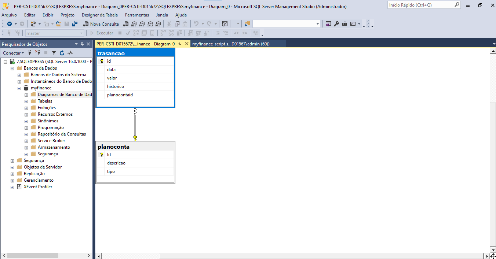
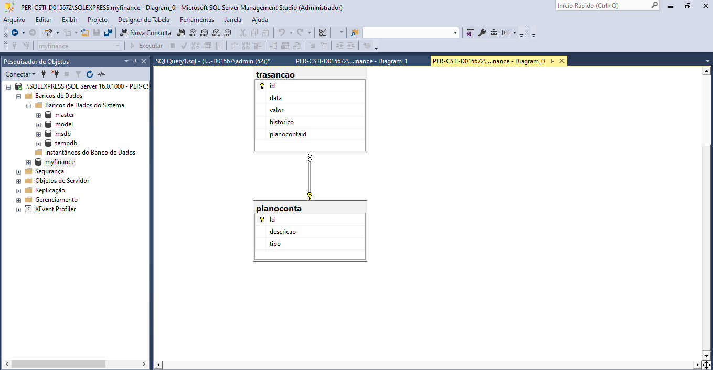
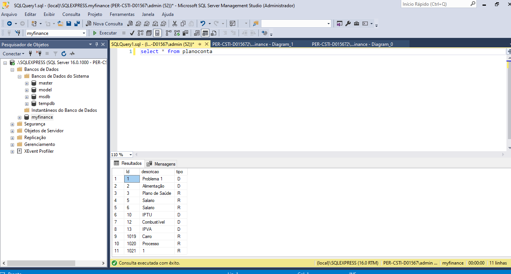
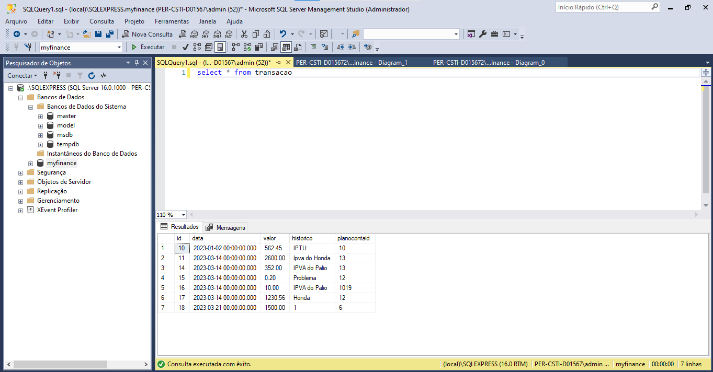
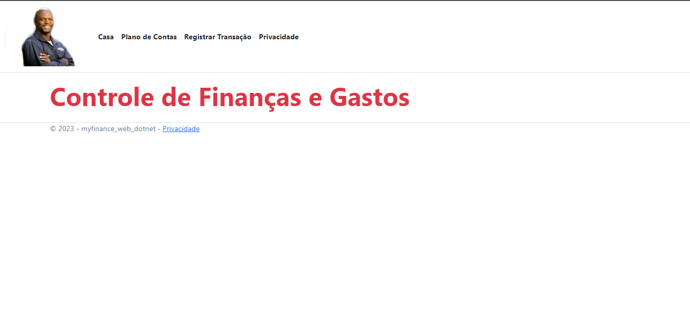
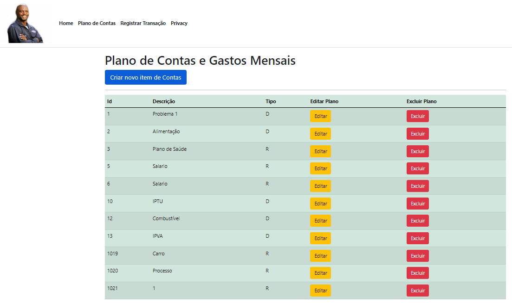
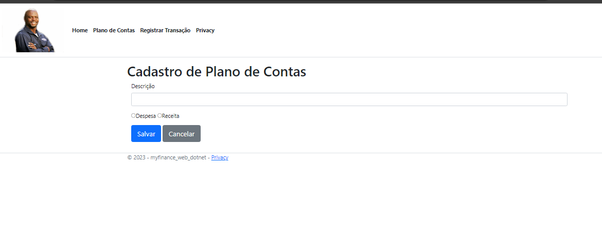
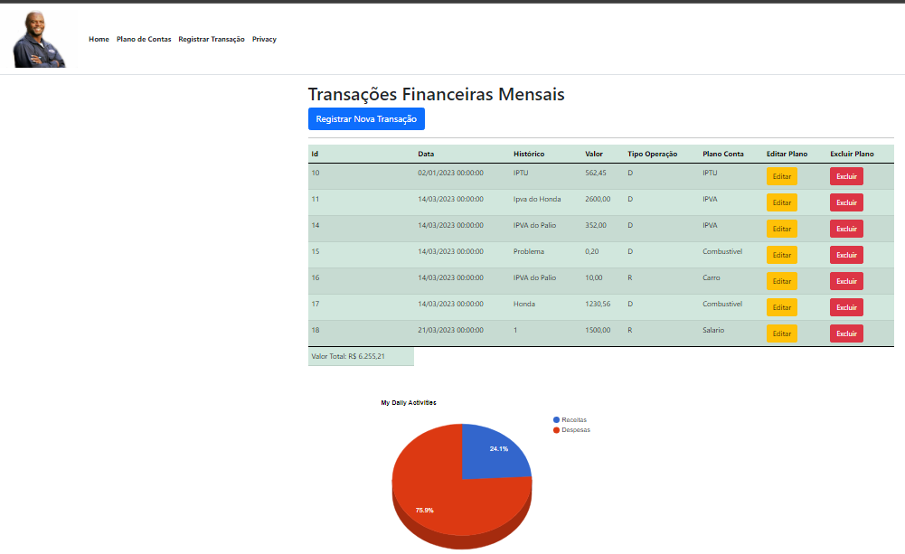
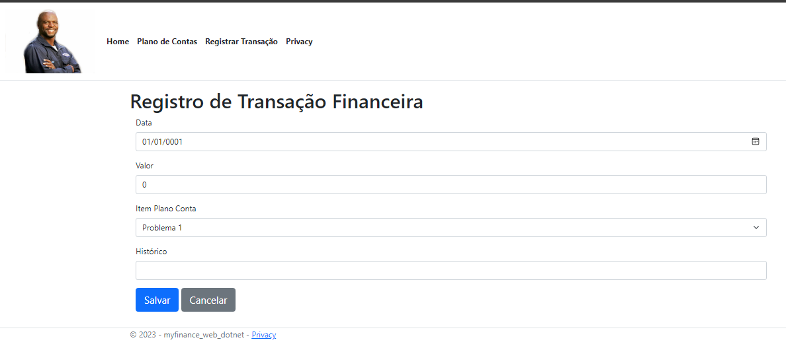

# myfinance-web-dotnet
MyFinance Web - Controle de Finanças
MyFinance - Projeto do Curso de Pós-Graduação em Engenharia da Computação PUC-MG.

Esse é um projeto para controle financeiro pessoa, utilizado para ajudar na medição, rastreabilidade e controle financeiro dos usuários.

É fundamental para garantir a saúde financeira a curto e longo prazo e para alcançar objetivos financeiros, como economizar para uma casa ou uma aposentadoria confortável.

Grupo 7

Carlos César
Cleuton Correa
Leonardo de Paula
Murillo Oliveira
Sillas Soares
O objetivo deste projeto é possibilitar que os usuários registrem suas entradas e saídas financeiras e analisem seus gastos, a fim de que o usuário realize um planejamento financeiro mais eficaz. Essa aplicação permitirá que o usuário crie um Plano de Contas personalizado para categorizar todas as transações, e também fornecerá um relatório detalhado das transações realizadas durante um determinado período.

Tecnologias
O projeto manipula as seguintes tecnologias:

ASP .NET MVC
SQL Server
Requisitos
Para abrir esse projeto, você deve ter instalado a última versão do Visual Studio Code e a versão 6.0 do SDK .Net.

O script de criação do banco de dados deve ser executado para total acesso as funcionalidades da aplicação.

Diagrama Entidade-Relacionamento - DER
O Banco de Dados da aplicação possuí duas tabelas:

transacao - que irá conter os dados das transações financeiras do usuário;
planoconta - que irá contecer os itens do Plano de Contas do usuário;

# SWE - Diagrama de Entidade e Relacionamento

# SWE - Diagrama de Entidade e Relacionamento

Tabela Plano Conta

Tabela Transaçao

Inicial Controle de Finanças e Gastos

Cadastro de Plano de Contas

Plano de contas e Gastos Mensais 

Transações Financeiras Mensais

Registro de Transação

 

